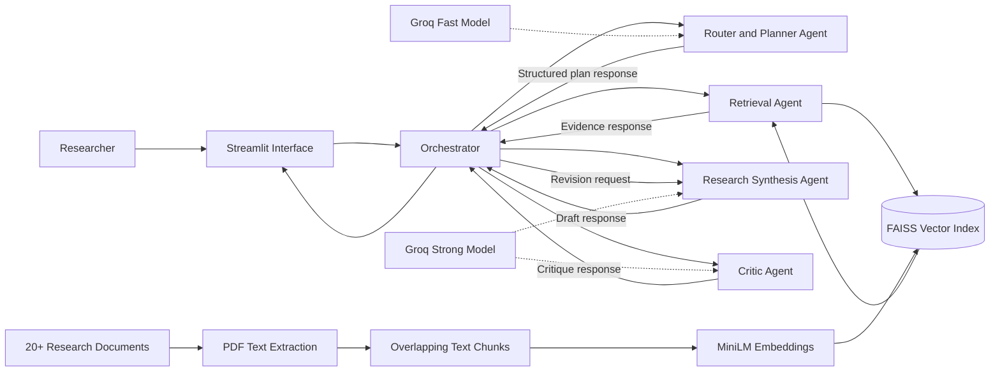
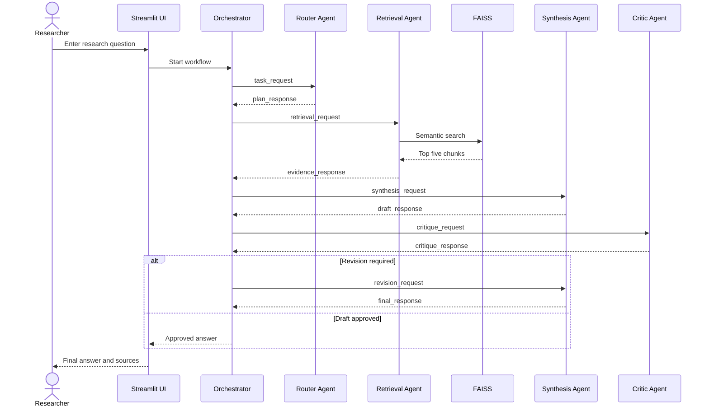

# StressLens LK

## Agentic Research Support for Academic Stress Studies among Sri Lankan Private Campus Undergraduates

StressLens LK is an Agentic AI research support application designed to help researchers explore academic stress among Sri Lankan private campus undergraduate students.

**Student:** W. Seshan Sandeepa
**Index Number:** ITBIN-2312-0024
**Documents:** 20
**Repository:** https://github.com/sandeepaseshan2-commits/stresslens-lk-agent

The system retrieves evidence from a domain-specific collection of research documents and uses specialised agents to plan, retrieve, synthesise and verify its answer.

## Problem

Research on academic stress contains information across many different papers. It can take a researcher considerable time to locate evidence about examination pressure, assignment pressure, financial pressure, performance pressure, study-life balance and coping strategies.

StressLens LK supports this process by retrieving relevant research evidence and creating a source-supported answer. It is not designed as a general PDF chatbot.

## Main Features

- Domain-specific academic-stress knowledge base
- Research-question classification
- Task planning and decomposition
- Semantic evidence retrieval
- Evidence-based research synthesis
- Critic and answer-revision workflow
- Structured agent-to-agent communication
- Retrieved source and similarity-score display
- Streamlit user interface

## System Architecture



## Agents

### Router and Planner Agent

The Router and Planner Agent identifies the user’s task type and creates a short plan. It uses the faster model because classification and simple planning do not require the strongest reasoning model.

Supported task types:

- Literature summary
- Factor comparison
- Coping-strategy analysis
- Research-gap identification
- Questionnaire support

### Retrieval Agent

The Retrieval Agent uses the FAISS semantic-search tool. It retrieves the five most relevant chunks and reduces repeated results from the same document.

### Research Synthesis Agent

The Research Synthesis Agent uses the stronger model to combine the retrieved evidence. It must use source labels such as `[S1]` and must not invent unsupported findings.

### Critic Agent

The Critic Agent checks whether the draft:

- Answers the research question
- Uses retrieved evidence
- Contains source labels
- Avoids unsupported claims
- Requires revision

### Orchestrator

The Orchestrator controls the complete workflow and records structured messages exchanged between the agents.

## Agentic Design Patterns

### 1. Router Pattern

The router classifies the user’s request and selects an appropriate research task.

### 2. Planning and Task-Decomposition Pattern

The planner divides the request into smaller steps, such as retrieval, comparison, synthesis and checking.

### 3. Tool-Use Pattern

The Retrieval Agent uses the FAISS semantic-search pipeline as an external tool.

### 4. Reflection Pattern

The Critic Agent evaluates the first draft. When problems are found, the Synthesis Agent revises the answer.

### 5. Orchestrator-Worker Pattern

The Orchestrator manages specialised worker agents and transfers structured messages between them.

## Agent Communication Protocol

Agents exchange Pydantic-validated messages containing:

- Protocol version
- Correlation ID
- Sender
- Receiver
- Message type
- Payload
- Timestamp

Example:

```json
{
  "protocol_version": "1.0",
  "correlation_id": "REQ-12AB34CD",
  "sender": "router_agent",
  "receiver": "orchestrator",
  "message_type": "plan_response",
  "payload": {
    "task_type": "factor_comparison",
    "plan": [
      "Retrieve evidence",
      "Compare findings",
      "Prepare an evidence-based answer"
    ]
  }
}
```

## Agent Communication Sequence



## Model Selection Strategy

Two different Groq models are deliberately assigned to different sub-tasks.

| Sub-task | Model | Context window | Input/output cost per 1M tokens | Measured average latency | Reason |
|---|---|---:|---:|---:|---|
| Routing and planning | `llama-3.1-8b-instant` | 131,072 | $0.05 / $0.08 | `< 0.389 second>` seconds | Fast and sufficient for classification and short planning |
| Research synthesis | `llama-3.3-70b-versatile` | 131,072 | $0.59 / $0.79 | `<0.378 second>` seconds | Better suited to combining evidence and preparing the final answer |
| Criticism and reflection | `llama-3.3-70b-versatile` | 131,072 | $0.59 / $0.79 | `<0.378 second>` seconds | Requires stronger reasoning to identify unsupported claims |

The measured latency values were obtained by running each model three times using the same short task. Results are stored in `evaluation/model_latency.csv`.

## RAG Pipeline

The Retrieval-Augmented Generation pipeline follows these steps:

1. Load the research documents.
2. Extract and clean PDF text.
3. Divide text into overlapping chunks.
4. Create embeddings.
5. Store normalised vectors in FAISS.
6. Convert the user question into an embedding.
7. Retrieve the five most similar chunks.
8. Send the evidence to the Synthesis Agent.
9. Check the answer using the Critic Agent.

## Knowledge Base

- Domain: Academic stress among undergraduate students
- Number of documents: `<20>`
- Document type: Research papers and domain-specific academic documents
- Main areas:
  - Examination pressure
  - Assignment pressure
  - Financial pressure
  - Performance pressure
  - Internship pressure
  - Study-life balance
  - Coping strategies
  - Sri Lankan undergraduate context

## Chunking Strategy

The documents are divided using word-based overlapping chunks.

- Chunk size: 180 words
- Chunk overlap: 40 words
- Minimum retained chunk: 30 words

The overlap helps preserve information that appears near the boundary between two chunks.

## Embedding Model

The system uses:

```text
sentence-transformers/all-MiniLM-L6-v2
```

The embedding model converts each research chunk and user query into a semantic vector.

## Vector Store

FAISS is used to store and search the vectors.

The project uses normalised vectors and an inner-product index to perform cosine-similarity retrieval.

## Retrieval Evaluation

The retrieval pipeline was tested using five research questions.

Detailed results:

```text
evaluation/retrieval_evaluation.csv
```

Summary:

```text
evaluation/retrieval_summary.md
```

Overall retrieval precision:

```text
<**Overall retrieval precision:** 1.00>
```

## Project Structure

```text
stresslens-lk-agent/
├── agents/
├── data/
│   ├── processed_text/
│   └── metadata.csv
├── docs/
├── evaluation/
├── models/
├── rag/
├── schemas/
├── utils/
├── vector_store/
├── app.py
├── requirements.txt
├── .env.example
└── README.md
```

## Local Installation

### 1. Clone the repository

```bash
git clone https://github.com/sandeepaseshan2-commits/stresslens-lk-agent
```

### 2. Create a virtual environment

```bash
python -m venv .venv
```

### 3. Activate it on Windows

```powershell
.\.venv\Scripts\Activate.ps1
```

### 4. Install dependencies

```bash
pip install -r requirements.txt
```

### 5. Create the environment file

Create `.env`:

```env
GROQ_API_KEY=your_key_here
GROQ_FAST_MODEL=llama-3.1-8b-instant
GROQ_STRONG_MODEL=llama-3.3-70b-versatile
```

Never commit the `.env` file.

### 6. Build the FAISS index

```bash
python -m rag.build_index
```

### 7. Run the terminal workflow

```bash
python -m agents.orchestrator
```

### 8. Run the Streamlit application

```bash
streamlit run app.py
```

## Live Application

[Open the live StressLens LK application](https://stresslens-lk-agent.streamlit.app/)

## Deployment

The application is deployed on Streamlit Community Cloud.

- Deployment branch: `main`
- Streamlit entry file: `app.py`
- Secrets management: Streamlit Community Cloud secrets
- Public application: [Open StressLens LK](https://stresslens-lk-agent.streamlit.app/)

## Error Handling

The application handles:

- Empty questions
- Missing API keys
- Invalid API keys
- API rate limits
- Missing FAISS index
- No retrieved evidence
- General model or workflow failures

## Known Limitations

- The answer quality depends on the selected document collection.
- Scanned image-only PDFs may not produce readable extracted text.
- The system may retrieve a related but not directly relevant chunk.
- The system does not replace expert academic judgment.
- Findings from international studies may not fully represent Sri Lankan private campus students.
- API availability and rate limits can affect response time.
- The system supports a limited set of research-support task types.

## External Tools and Libraries

- Python
- Streamlit
- Groq API
- Sentence Transformers
- FAISS
- Pydantic
- pypdf
- pandas
- NumPy
- python-dotenv
- Git and GitHub

## Academic Integrity Declaration

This project was developed for the IT41043 Agentic AI assignment.

External libraries, models and development tools used in the project are disclosed in this README. The student is responsible for understanding, explaining and modifying every part of the submitted implementation during the live demonstration.