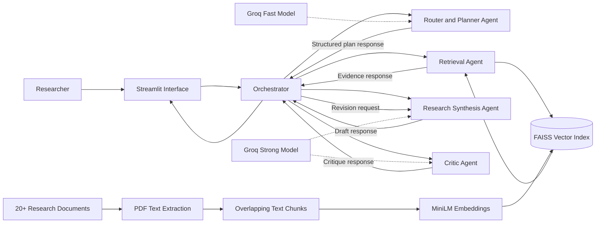

# StressLens LK Architecture

```mermaid
flowchart LR
    U[Researcher] --> UI[Streamlit Interface]
    UI --> O[Orchestrator]

    O --> R[Router and Planner Agent]
    R -->|Structured plan response| O

    O --> K[Retrieval Agent]
    K --> V[(FAISS Vector Index)]
    V --> K
    K -->|Evidence response| O

    O --> S[Research Synthesis Agent]
    S -->|Draft response| O

    O --> C[Critic Agent]
    C -->|Critique response| O

    O -->|Revision request| S
    O --> UI

    FAST[Groq Fast Model] -.-> R
    STRONG[Groq Strong Model] -.-> S
    STRONG -.-> C

    D[20+ Research Documents] --> E[PDF Text Extraction]
    E --> CH[Overlapping Text Chunks]
    CH --> EM[MiniLM Embeddings]
    EM --> V
```