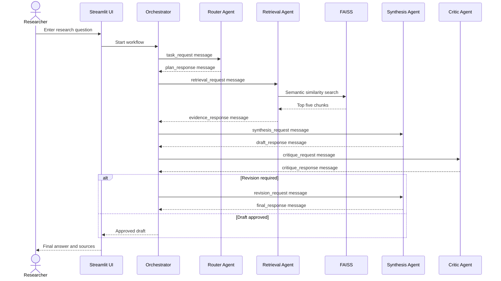

# Agent Communication Sequence

```mermaid
sequenceDiagram
    actor U as Researcher
    participant UI as Streamlit UI
    participant O as Orchestrator
    participant R as Router Agent
    participant K as Retrieval Agent
    participant V as FAISS
    participant S as Synthesis Agent
    participant C as Critic Agent

    U->>UI: Enter research question
    UI->>O: Start workflow

    O->>R: task_request message
    R-->>O: plan_response message

    O->>K: retrieval_request message
    K->>V: Semantic similarity search
    V-->>K: Top five chunks
    K-->>O: evidence_response message

    O->>S: synthesis_request message
    S-->>O: draft_response message

    O->>C: critique_request message
    C-->>O: critique_response message

    alt Revision required
        O->>S: revision_request message
        S-->>O: final_response message
    else Draft approved
        O-->>UI: Approved draft
    end

    UI-->>U: Final answer and sources
```